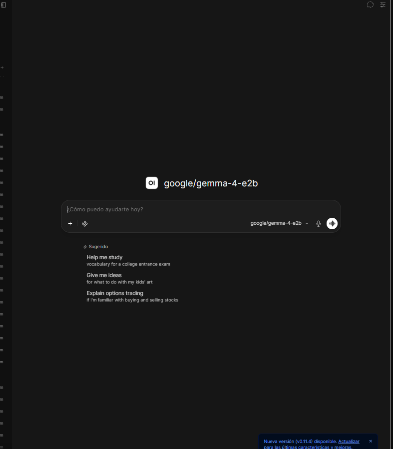
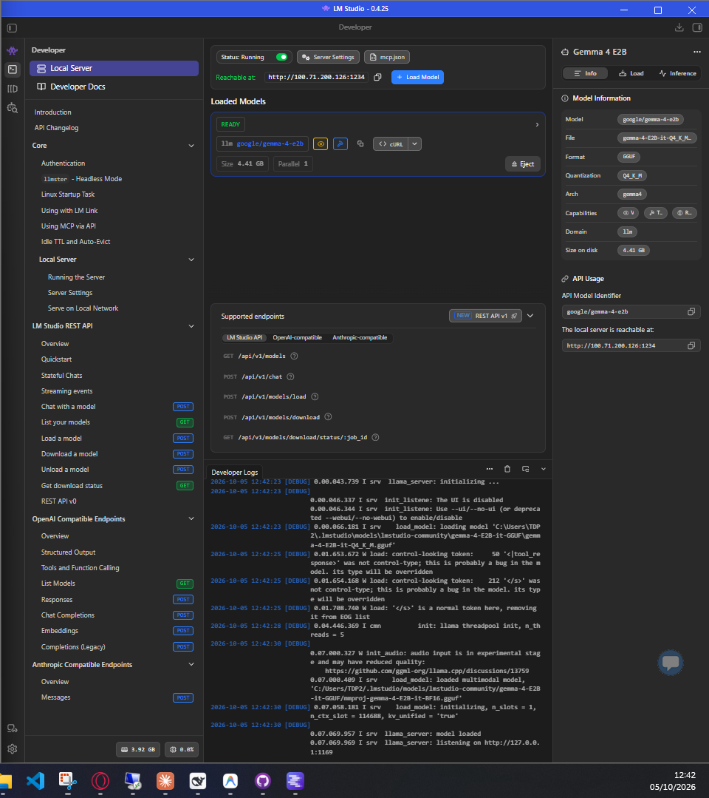

# 🤖 AI Data Assistant (Open WebUI + LM Studio / Ollama + PostgreSQL)

Sistema empresarial de IA privada que conecta **Open WebUI** con modelos de lenguaje locales (LLMs) ejecutados a través de **LM Studio / Ollama** y bases de datos PostgreSQL en tiempo real mediante herramientas personalizadas en Python.

Diseñado para permitir a empresas desplegar un ecosistema de IA **100% On-Premise, seguro, auditable y sin costes recurrentes de licencias o APIs externas**.

---

## ✨ Funcionalidades Avanzadas de Nivel Empresarial

- 🔒 **100% Privado y Gratuito:** Basado en modelos de código abierto ejecutados en local (LM Studio / Ollama). Privacidad total de datos financieros, logísticos y de clientes.
- 🏢 **Modelos Personalizados por Departamento:**
  - Selección del LLM idóneo según la tarea (Razonamiento complejo, Cálculo matemático/estadístico, Modelos Multimodales para Análisis de Imágenes, etc.).
  - Configuración de *System Prompts* específicos por rol de trabajo.
- 👥 **Control de Accesos y Permisos Granulares (RBAC):**
  - Asignación de herramientas, modelos y bases de conocimiento específicas por grupos de trabajo o empleados individuales.
  - Restricción de acceso para que cada departamento consulte únicamente la información autorizada.
- 📊 **Auditoría y Control de Consultas:** Registro y trazabilidad de las preguntas y herramientas utilizadas por los usuarios.
- ⚡ **Consultas a BBDD en Tiempo Real:** Herramienta custom en Python que traduce preguntas en lenguaje natural a consultas SQL `SELECT`.
- 🛡️ **Seguridad contra Modificaciones:** Filtros estrictos de solo lectura (`DROP`, `DELETE`, `UPDATE` bloqueados) y timeouts de seguridad.
- 📚 **RAG Multiformato (Bases de Conocimiento):** Indexación de PDFs, documentación técnica, manuales y texto plano para respuestas contextualizadas con documentación interna.

---

## 🛠️ Stack Tecnológico

| Componente | Tecnología |
|---|---|
| Interfaz de Usuario & Gestión | Open WebUI (Docker) |
| Motor de Inferencia Local | LM Studio (Servidor OpenAI-Compatible) / Ollama |
| Base de Datos | PostgreSQL |
| Integraciones Custom | Python (`psycopg2`) con filtrado de seguridad |
| Orquestación y Contenedores | Docker + Docker Compose |
| Capacidades LLM | Texto, RAG (PDF/Docs), Visión/Multimodal, SQL Agent |

---

## 🏗️ Arquitectura del Sistema

```
                        👤 Empleados / Departamentos
                                     │
                                     ▼
                     🖥️ Open WebUI (Docker - Puerto 3080)
           (Gestión de Permisos RBAC + Auditoría + RAG de PDFs)
                                     │
         ┌───────────────────────────┴───────────────────────────┐
         ▼                                                       ▼
🧠 Servidor LLM Local (LM Studio/Ollama)               🐍 Custom Python Tool
(Modelos: Razonamiento, Muestreo, Visión)            (Filtros de Seguridad SQL)
                                                                 │
                                                                 ▼
                                                   🗄️ PostgreSQL (Datos en tiempo real)
```

---

## 📸 Demostración del Sistema

### 1. Interfaz de Chat (Open WebUI con acceso a BBDD)


### 2. Motor de Inferencia Local (LM Studio Modo Servidor)


---

## 📁 Estructura del Repositorio

- `docker/`: Archivos `docker-compose.yml` para desplegar Open WebUI.
- `scripts/`: Herramientas personalizadas en Python para Open WebUI (Conector PostgreSQL seguro).
- `docs/`: Capturas de pantalla y documentación gráfica de la arquitectura.

---

## 👤 Autor

**Ignacio** — [GitHub Profile](https://github.com/nachovillatech)
